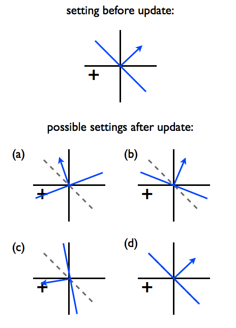

# Problem 3

There are 3 questions.

## Passive-Aggressive (PA) Perceptron Algorithm

The PA algorithm (without offset) responds to a labeled training example $(x,y)$ by finding $\theta$ that minimizes
$$
\displaystyle  \frac{\lambda }{2}\left\|  \theta - \theta ^{(k)} \right\| ^2 + \text {Loss}_ h(y \theta \cdot x)
$$
where $\theta^{(k)}$ is the current setting of the parameters prior to encountering $(x,y)$ and hinge loss is
$$
\text {Loss}_ h(y \theta \cdot x) = \max \{ 0,1-y \theta \cdot x\}
$$
The loss function can also be something else. The update rule is 
$$
\displaystyle  \theta ^{(k+1)} = \theta ^{(k)} + \eta \,  y x
$$
where the step-size parameter $\eta$ depends on both $\theta^{(k)}$ and the training example $(x,y)$.

> #### Question 9:
>
> Considering the loss function above, what happens to the $\eta$ at large values of $\lambda$?
>
> > **Answer**: if $\lambda$ is large, the step-size of the algorithm $\eta$ would be small.
>
> > **Solution**: As $\lambda$ serves as the weight for the regularization term, it prevents overfitting of the minimizing function, thus a large $\lambda$ increases to make step size of an update decrease.

> #### Question 10:
>
> Suppose $\text {Loss}_ h(y \theta ^{(k+1)}\cdot x)>0$ after the update. Express the value of $\eta$ in terms of $\lambda$ in this case.
>
> > **Answer**: $\frac{1}{\lambda}$
>
> > **Solution**: Given $\text {Loss}_ h(y \theta ^{(k+1)}\cdot x)>0$, we know $\text{Loss}_h = 1-y \theta \cdot x$. Plug in the loss function:
> > $$
> > \begin{aligned}
> > f(\theta)& = \frac{\lambda }{2}\left\|  \theta - \theta ^{(k)} \right\| ^2 + \text {Loss}_ h(y\theta \cdot x)\\
> > & = \frac{\lambda }{2}\left\|  \theta - \theta ^{(k)} \right\| ^2 + 1-y\theta \cdot x \\
> > \end{aligned}
> > $$
> > Compute the minimum by setting gradient of $f(\theta)$ w.r.t. $\theta$ to 0:
> > $$
> > \begin{aligned}
> > \nabla _\theta f &=  \lambda (\theta - \theta ^{(k)}) - yx = 0 \\
> > (\theta - \theta ^{(k)}) &= \frac{1}{\lambda}yx\\
> > \theta &= \theta^{(k)} + \frac{1}{\lambda}yx\\
> > \end{aligned}
> > $$
> > where $\frac{1}{\lambda}$ is just the step size.
> >
> > Thus $\eta = \frac{1}{\lambda}$.

> #### Question 11:
>
> 1. hinge loss and a large $\lambda$
> 2. hinge loss and a small $\lambda$
> 3. 0-1 loss and a large $\lambda$
> 4. 0-1 loss and a small $\lambda$
>
> Each of the options below provides a matching between the 4 variations above with a decision boundary plotted in a-d below. Please choose the options that match them correctly. Note that the dotted lines correspond to the previous decision boundary, and the solid blue lines correspond to the new decision boundary.
>
> 
>
> > **Answer**: 4a, 1b, 2c, 3d
>
> > **Solution**: 
> >
> > Note that 0-1 loss only takes the values 0 (if it's correctly classified) and 1 (incorrectly classified)
> >
> > With small $\lambda$, the change of loss term dominates.
> >
> > * Hinge loss: The loss can be decreased by moving the $\theta$ vector towards the example. Hinge loss will correctly classify the example with a margin from the boundary, because hinge loss is minimized when $y\theta \cdot x \geq 1$.
> > * 0-1 loss: The loss function can only improve when it is classified correctly, so the example must be on the positive side. The loss is minimized when $y\theta \cdot x \geq 0$, so there is no margin. 
> >
> > With large $\lambda$, the change in $\theta$ term dominates.
> >
> > *  Hinge loss: loss can be decreased by moving the $\theta$ vector towards the example. However, the $\theta$ rotates only slightly when $\lambda$ is large.
> > * 0-1 loss: In order to minimized the change in $\theta$ when minimizing the objective, it simply stays the same after the update and does not improve the loss.

