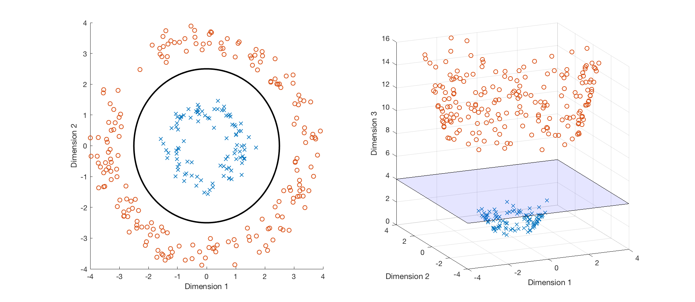

# Problem 2

There are 2 questions

## Kernels

> #### Question 1:
>
> Let $x, q \in \R^2$ be two feature vectors, the polynomial kernel can be written as $K(x,q) = (x^ Tq + 1)^2$. Assuming we can write $K(x,q) = \phi (x)^ T\phi (q)$, derive and expression for $\phi(x)$.
>
> > **Answer**: $\phi(x) = [1,\sqrt{2}x_1,\sqrt{2} x_2,x_1^2, \sqrt{2} x_1 x_2, x_2^2]$
>
> > **Solution**: 
> >
> > We can write the kernel as:
> > $$
> > K(x,q) = (x^ Tq + 1)^2 = \left(1 + \sum _{i=1}^2{x_ i q_ i} \right)^2 = (x_1 q_1 + x_2 q_2 + 1)^2
> > $$
> > Expanding and combining terms gives:
> > $$
> > x_1^2 q_1^2 + x_2^2 q_2^2 + 2 x_1 x_2 q_1 q_2 + 2 x_1 q_1 + 2 x_2 q_2 + 1
> > $$
> > We can then rewrite this expression as $\phi (x)^ T\phi (q)$ where:
> > $$
> > \phi (x) = [x_1^2, x_2^2, \sqrt{2} x_1 x_2, \sqrt{2} x_1, \sqrt{2} x_2, 1]
> > $$

> #### Question 2: 
>
> A set of 2-D points are mapped to the 3-D space via some transformation $\phi(x)$. Note that $\phi(x)_1 = x_1$ and $\phi(x)_2 = x_2$, or in other words, the first and second coordinates are unchanged by the transformation. 
>
> 
>
> Which of the following functions could have been used to compute the value of the 3rd coordinate $\phi(x)_3$ for each points?
>
> A. $\phi(x)_3 = x_1 + x_2$
>
> B. $\phi(x)_3 = x_1^2 + x_2^2$
>
> C. $\phi(x)_3 = x_1 x_2$
>
> D. $\phi(x)_3 = x_1^2 - x_2^2$
>
> > **Answer**: B
>
> > **Solution**: 
> >
> > Think about how a linear decision boundary in the 3-D space $\{  \phi \in \mathbb {R}^{3}: \theta \cdot \phi + \theta _0 = 0\}$ might appear in the original 2-D space. 
> >
> > For example, suppose the decision boundary in the 3-D space is $z = 4$. An equation $f(x_1, x_2) = 0$ in the 2-D space such that all the points $(x_1, x_2)$ with $f(x_1, x_2) > 0$ correspond to $z > 4$ in the 3-D space is:
> > $$
> > f(x_1, x_2) = 0 = x_1^2 + x_2^2 - 4
> > $$

#### A key point: 

1. In a kernel method, the optimization problem for training would be typically expressed solely in terms of the kernel function $K(x,x')$ (**dual**) rather than using the associated feature vectors $\phi(x)$ (**primal**). 

For example,  consider fitting a kernelized SVM to a dataset $(x^{(i)}, y^{(i)})$ where $x^{(i)} \in \R^2$ and $y^{(i)} \in \{1, -1\}$ for all $i = 1, ..., n$. To fit the parameters of this model, one computes $\theta$ and $\theta_0$ to minimize the following objective:
$$
L(\theta , \theta _0) = \frac{1}{n} \sum _{i=1}^{n}\text {Loss}_ h\left(y^{(i)}\left(\theta \cdot \phi \left(x^{(i)}\right)+\theta _0\right)\right) + \frac{\lambda }{2}\| \theta \| ^{2}
$$
where $\phi$ is the feature vector associated with the kernel function.

