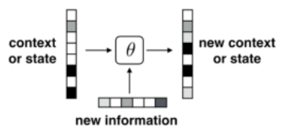

# Recurrent Neural Networks (RNNs)

There are 5 topics and 1 exercise.

## 1. Introduction

RNNs can be useful than ANNs because in general RNNs automatically address some issues that need to be engineered with feed-forward networks, such as answering "*How many time steps back should we look at in the feature vector?*"  

* An inconvenient aspect of feed-forward networks is that we have to **manually engineer how history is mapped to a feature vector (representation)**. This mapping into feature vectors (**encoding**) is also what we would like to learn. **RNN's learn the encoding into a feature vector**, unlike feed-forward networks.

Sentiment analysis, language translation, and language modelling can be realized by RNNs, but each **task requires a different sentence representation** as they focus on different parts of the sentence.

* Sentiment analysis focuses on the holistic meaning of a sentence, while translation focuses more on individual words.

## 2. Encoding with RNNs

This is a typical structure of a single-layered recurrent neural network. 

$$
s_ t = \tanh (W^{s,s}s_{t-1} + W^{s,x}x_ t)
$$
$s_t$ $(m \times 1)$ is new context or state, $s_{t-1}$ $(m \times 1)$ is current context or state. $x_t$ $(d \times 1)$ is new information. $W^{s,s}$ $(m \times m)$, $W^{s,x}$ $(m \times d)$ are parameters. $W^{s,s}$ and $W^{s,x}$ determine $\theta$, which can be adjusted. $W^{s,s}$ decides what part of the previous information to keep. $W^{s,w}$ takes into account new information.

Three **differences** between the encoder (unfolded RNN) and a standard feed-forward architecture.

* **Input is received at each layer** (per word), not just at the beginning as in a typical feed-forward network.
* The number of layers varies, and depends on the **length of the sentence**.
* Parameters of each layer (representing an application of an RNN) are **shared** (same RNN at each step).

One **problem** of RNN: 

* vanishing / exploding gradient

## 3. Gating and LSTM

#### Gating

The gate vector $g_t$ which is of the same dimension as $s_t$, determines "*how much information to overwrite in the next state*." In this case, it can learn to control how much to update.

A single-layered **gated RNN** can be written as
$$
\begin{aligned}
g_t & = \text {sigmoid}(W^{g,s}s_{t-1}+W^{g,x}x_{t})\\
s_t & = (1-g_ t) \bigodot s_{t-1} + g_ t \bigodot \tanh (W^{s,s}s_{t-1} + W^{s,x}x_ t).\\
\end{aligned}
$$
where the sign $⨀$ denotes element-wise multiplication.

#### LSTM

$c_t$ represents the memory cell, and $h_t$ represents the visible state. $[c_t, h_t]$ represents the new context or state. $[c_{t-1}, h_{t-1}]$ represents the current context or state.

## 4. Markov Models

Markov symbols includes a start symbol ("\<beg\>"), an end symbol ("\<end\>"), and a symbol for unknown words ("UNK").

The Markov model computes the probability of a sentence "\<bed\> ML course is UNK \<end\>"as
$$
P = p(\text{ML}|\text{<bed>})p(\text{course}|\text{ML})p(\text{is}|\text{course})p(\text{UNK}|\text{is})p(\text{<end>}|\text{UNK})
$$
 Since
$$
p_k= p(w_i=k|w_{i-1})
$$

#### Feature based Markov Model as Neural Network

Given one-hot encoded feature vectors $\phi(w_{i-1}) = x$ as the input units, and the output units are the probabilities of the words, the neural network is trying to model:
$$
p_k= p(w_i=k|w_{i-1})
$$
The weighted summation of the inputs $z_k \in \R$ is represented as
$$
z_k = \sum_jx_jW_{jk} + W_{ok}
$$
The non-linear transformation need to make  $p_k \geq 0$ and $\sum_k p_k = 1$ over all possible next words.

One possible transformation is **softmax** **transformation**, which exponentializes the input values and normalizes them over the output units. This constructs a softmax output layer.
$$
p_k = \frac{e^{z_k}}{\sum_j e^{z_j}}
$$
**Advantage** of Feature based Markov Model as Neural Network: 

* Extendable to multi-gram language model.
* The complexity is easily controlled by introducing hidden layers.
* Neural networks contain a fewer number of parameters.

> #### Exercise 28
>
> Suppose you have a word vocabulary of size 10 (including <beg> and <end>), and you were using a trigram language model to predict the next word. How many parameters would you need for a **Markov Model**? How many parameters would you need for a **feedforward neural network** that contained biases and no hidden units?
>
> > **Answer**: 1000; 210
>
> > **Solution**: 
> >
> > A Markov model would have 100 choices for the previous two words, and 10 choices for the next word, leading to a size of 1000. 
> >
> > A feedforward neural network would have an input layer of size 20 and an output layer of size 10, leading to a weight matrix of size 200. We add 10 parameters for the bias vector.

## 5. RNN Decoder

**Decoder** decodes a vector encoding of a sentence into another sentence. It is usually used for language translation or image annotation. 
$$
\begin{aligned}
s_t & = \tanh(W^{s,s}s_{t-1} + W^{s,x}x_t)\\
p_t & = softmax (W^{0}s_t)\\
\end{aligned}
$$
As shown in the formula above, the previous output $x_t$ is fed into the next step. Unlike in encoding, at each step, an output distribution $p_t$ is produced in a decoding RNN. In other words, the probability distribution is different at each step. With the probability distribution at each step, the output word is then sampled from the distribution.

When doing prediction with testing data, the sampled outputs are used at one time step as the input for the next step.