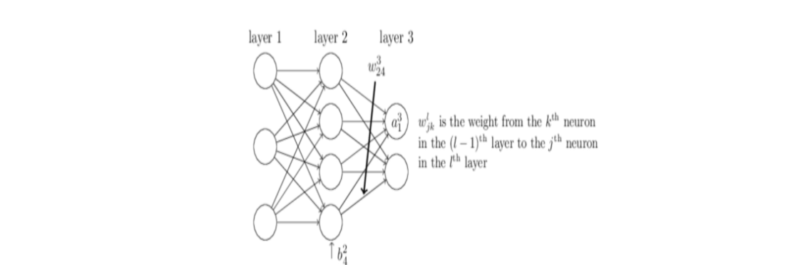

# Problem 1

There are 4 questions.

## Backpropagation

Consider the $L$-layer neural network below: 

We will use the notation $b^l_j, a^l_j, \text{ and }w^l_{jk}$ as shown in the network. If the activation function is $f$ and the loss function we are minimizing is $C$, then the equations describing the network are 
$$
a_j^l= f \left( \sum _ k w_{jk}^ l a_ k^{l-1} + b_ j^ l \right)\\
\text{Loss} = C(a^L)
$$
Let the weighted inputs to the $d$ neurons in layer $l$ be defined as $z^ l \equiv w^ l a^{l - 1} + b^ l$, where $z^ l \in \mathbb {R}^ d$. As as result, we can also write the activation of layer $l$ as $a^ l \equiv f(z^ l)$, and the "error" of neuron $j$ in layer $l$ as $\delta _ j^ l \equiv \frac{\partial C}{\partial z_ j^ l}$. Let $\delta ^ l \in \mathbb {R}^ d$ denote the full vector of errors associated with layer $l$, which can be computed by backpropagation. 

> #### Question 1: Compute the Error
>
> Assume there are $d$ outputs from the last layer (i.e. $a^ L \in \mathbb {R}^ d$). What is $\delta _ j^ L$ for the last layer? What is $\delta _ j^ L$ for all $l \neq L$? 
>
> > **Answer**: 
> >
> > For the last layer: $\delta _ j^ L = \frac{\partial C}{\partial a_ j^ L} f'(z_ j^ L)$; 
> >
> > For all $l \neq L$: $\delta _ j^ l = \sum _ k w_{kj}^{l + 1} \delta _ k^{l + 1} f'(z_ j^ l)$.
>
> > **Solution**: 
> >
> > By chain rule,
> > $$
> > \delta _ j^ L = \frac{\partial C}{\partial a_ j^ L} \frac{\partial a_ j^ L}{\partial z_ j^ L} = \frac{\partial C}{\partial a_ j^ L} f'(z_ j^ L)
> > $$
> >
> > $$
> > \begin{aligned}
> > \delta _ j^ l & = \frac{\partial C}{\partial z_ j^ l}\\
> > & = \sum _ k \frac{\partial C}{\partial z_ k^{l + 1}} \frac{\partial z_ k^{l + 1}}{\partial z_ j^ l}\\
> > & = \sum _ k \frac{\partial z_ k^{l + 1}}{\partial z_ j^ l} \delta _ k^{l + 1}
> > \end{aligned}
> > $$
> >
> > Since we have 
> > $$
> > z_ k^{l + 1} = \sum _ j w_{kj}^{l + 1} a_ j^ l + b_ k^{l + 1} = \sum _ j w_{kj}^{l + 1} f(z_ j^ l) + b_ k^{l + 1}
> > $$
> > Taking the derivative of this with respect to $z_ j^ l$ gives $\frac{\partial z_ k^{l + 1}}{\partial z_ j^ l} = w_{kj}^{l + 1} f'(z_ j^ l)$.
> >
> > Therefore,
> > $$
> > \delta _ j^ l = \sum _ k w_{kj}^{l + 1} \delta _ k^{l + 1} f'(z_ j^ l)
> > $$

> #### Questions 2: Parameter Derivatives
>
> What are the partial derivatives of the loss with respect to our parameters: $\frac{\partial C}{\partial w_{jk}^ l}$ and $\frac{\partial C}{\partial b_ j^ l}$ ?
>
> > **Answer**: 
> > $$
> > \frac{\partial C}{\partial w_{jk}^ l} = \frac{\partial C}{\partial z_ j^ l} \frac{\partial z_ j^ l}{\partial w_{jk}^ l} = a_ k^{l - 1} \delta _ j^ l\\
> > \frac{\partial C}{\partial b_{j}^ l} = \frac{\partial C}{\partial z_ j^ l} \frac{\partial z_ j^ l}{\partial b_{j}^ l} = 1 * \delta _ j^ l
> > $$

> #### Question 3: Activation Function: Sigmoid
>
> What is the derivative of sigmoid function $\sigma (z) = \frac{1}{1 + e^{-z}}$?
>
> > **Answer**: $\sigma'(z) = \frac{e^{-z}}{\left(1+e^{-z}\right)^{2}}$
>
> > **Solution**: $\sigma '(z) = \sigma (z)(1 - \sigma (z))$ as $z$ gets large in magnitude, the sigmoid function saturates, and the gradient approaches zero.

> #### Question 4: Simple Network
>
> Consider a simple 2-layer neural network with a single neuron in each layer. The loss function is the quadratic loss: $C=1/2(y−t)^2$, where $y$ is the prediction and $t$ is the target.
>
> Starting with input $x$ we have:
>
> * $z_1 = w_1 x$
> * $a_1 = \text {ReLU}(z_1)$
> * $z_2 = w_2a_1 + b$
> * $y = \sigma (z_2)$
> * $C = \frac{1}{2}(y - t)^2$
>
> How to compute the following derivatives?
>
> $\frac{\partial C}{\partial w_1},\frac{\partial C}{\partial w_2}, \frac{\partial C}{\partial b}$
>
> > **Answer**: 
> >
> > $\frac{\partial C}{\partial w_1} = \frac{\partial C}{\partial y} \frac{\partial y}{\partial z_2} \frac{\partial z_2}{\partial a_1} \frac{\partial a_1}{\partial z_1} \frac{\partial z_1}{\partial w_1} = (y - t) y(1 - y)w_2 \mathbf{1}\{ z_1 > 0\}  x$
> >
> > $\frac{\partial C}{\partial w_2} = \frac{\partial C}{\partial y} \frac{\partial y}{\partial z_2} \frac{\partial z_2}{\partial w_2} = (y - t) y(1 - y)a_1$
> >
> > $\frac{\partial C}{\partial b} = (y - t) y(1 - y)$

